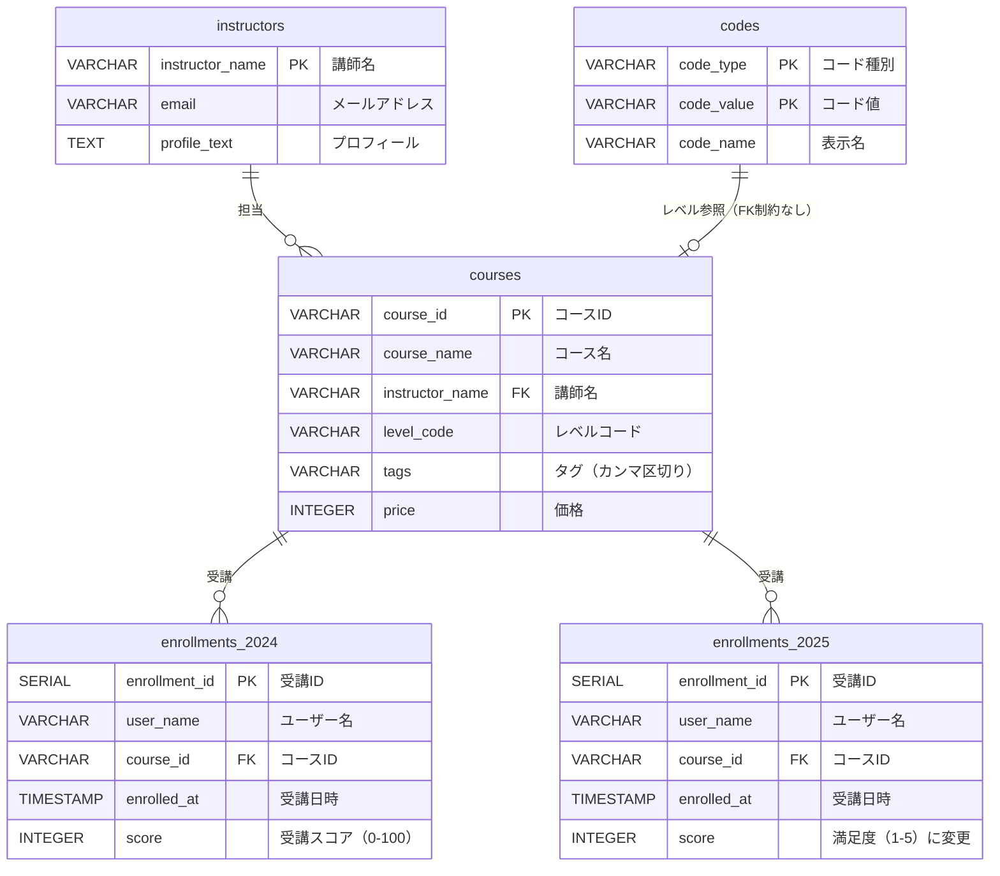

# 第7章 論理設計のアンチパターン - 学習ノート

## 書籍の内容

第7章では以下の8つのアンチパターンが紹介されている:

| # | アンチパターン | 概要 |
|---|---|---|
| 7-2 | 非スカラ値 | 1つのカラムに複数の値（配列、カンマ区切り等） |
| 7-3 | ダブルミーニング | 1つのカラムが条件によって異なる意味を持つ |
| 7-4 | 単一参照テーブル | すべてのコード値を1つのテーブルにまとめる |
| 7-5 | テーブル分割 | 水平分割（年度別等）・垂直分割で論理的に1つのテーブルを分ける |
| 7-6 | 不適切なキー | 可変長文字列やNULLを含む列をキーにする |
| 7-7 | ダブルマスタ | 同じ意味のマスタが複数存在する |
| 7-8 | ゾンビマート・多段マート | 使われないマートの残存、マートからマートを作る多段化 |

## ER図（現状の設計）

## 演習の思考過程

### 問1: アンチパターンの特定

5つのアンチパターンを特定した:

| # | テーブル | アンチパターン | 問題箇所 |
|---|---|---|---|
| 1 | `courses` | 非スカラ値 | `tags`がカンマ区切りで複数の値を格納 |
| 2 | `codes` | 単一参照テーブル | 全コード値を1テーブルに集約 |
| 3 | `enrollments_20XX` | テーブル分割（水平） | 年度別にテーブルを分割 |
| 4 | `enrollments_2025` | ダブルミーニング | `score`の意味が年度で変化（スコア→満足度） |
| 5 | `instructors` | 不適切なキー | 可変長文字列の講師名がPK |

### 問2: 最優先の修正

**不適切なキー（instructors）を最優先とした。**

- 理由: キーが重複した時点でリレーションが壊れるため、最も致命的
- 修正: `instructor_name`(VARCHAR) → `instructor_id`(CHAR(8)) に変更
  - emailをPKにする案は却下 → emailも変更される可能性がある
  - SERIAL(INTEGER)ではなくCHAR固定長を選択した理由:
    - **SERIAL/INTEGERも固定長なのでデータ型としては問題ない**　←　ここを誤解していた
    - SERIALはDBが自動採番するサロゲートキーであり、ビジネス上の意味を持たない
    - サロゲートキー自体は悪くないが、CHAR(8)なら`INST0001`のようにコード体系を設計者がコントロールできる
    - 書籍の7-6で指摘されているのは「可変長文字列をキーにするな」というデータ型の話であり、SERIALが不適切なキーに該当するわけではない
  - **学び: 「SERIALだからダメ」ではなく「設計意図を明示できるコード体系の方がより良い」という優劣の話**

### 修正方針の確認

各アンチパターンの修正方針:

| アンチパターン | 修正方針 |
|---|---|
| 非スカラ値（tags） | `course_tags`中間テーブルを作り、1行1タグで格納 |
| 単一参照テーブル（codes） | `course_levels`, `user_roles`等の個別テーブルに分離 |
| テーブル分割（enrollments） | テーブル統合 + 必要ならパーティションで対応 |
| ダブルミーニング（score） | `score`と`satisfaction`を別カラムとして定義する（リネームではダメ） |
| 不適切なキー（instructor_name） | CHAR(8)の`instructor_id`をPKにする |

**ダブルミーニングの修正で「カラム名を抽象化してどちらも入れられるようにする」のは誤り。** カラムの意味が変わっている問題は、カラムを分けることでしか解決できない。
