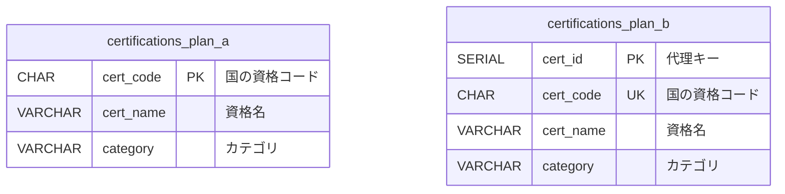
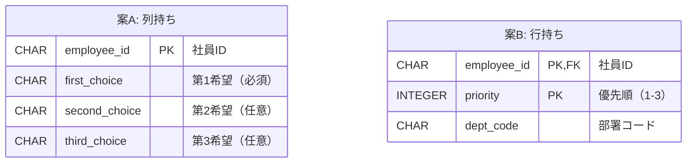
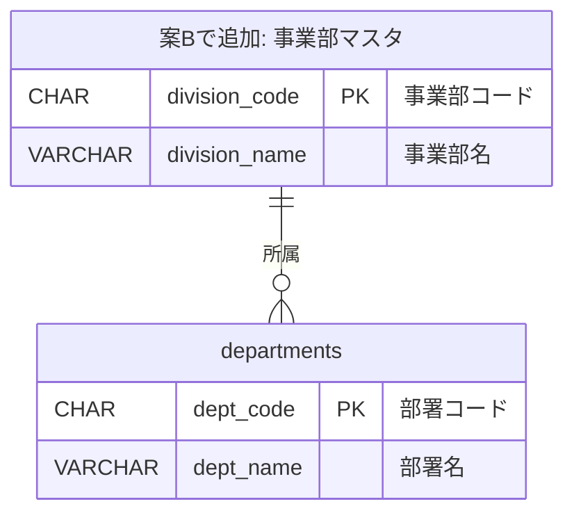
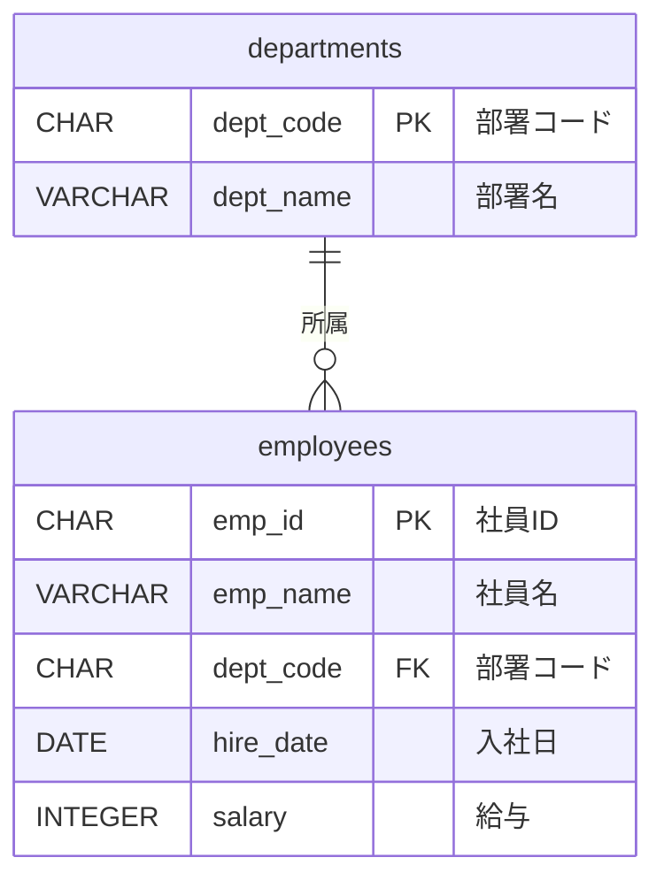

# 第8章 論理設計のグレーノウハウ - 学習ノート

## 演習作成の意図

第8章のテーマは「アンチパターンとまでは言えないが、慎重な判断が必要」なグレーゾーンの設計。第7章が「明確にダメなものを見抜く力」を問うたのに対し、第8章は「どちらも一理ある中でどちらを選ぶか」というトレードオフの判断力を問う。そこで、各グレーノウハウ（代理キー、列持ち/行持ち、アドホックな集計キー、多段ビュー）について複数の設計案を提示し、利点・欠点を比較した上で「自分ならどちらを選ぶか、なぜか」を答える形式にした。「唯一の正解」がない問いに対して根拠をもって判断する力を養うことが狙い。

## 書籍の内容

第8章では「アンチパターンとまでは言えないが、慎重な判断が必要」なグレーゾーンの設計を扱う:

| # | テーマ | 概要 |
|---|---|---|
| 8-2 | 代理キー | 自然キーが不安定な場合にサロゲートキーで補う |
| 8-3 | 列持ちテーブル | 配列的データを列で持つか行で持つかの判断 |
| 8-4 | アドホックな集計キー | 集計用のコード列を既存テーブルに追加する |
| 8-5 | 多段ビュー | ビューの上にビューを重ねる多段構造の危険性 |
| 8-6 | データクレンジング | DB設計前にデータ品質を整える重要性 |

## ER図

### 問1: 資格マスタ（案A: 自然キー vs 案B: 代理キー）



### 問2: 異動希望先（案A: 列持ち vs 案B: 行持ち）



### 問3: 部署と事業部



### 問4: 多段ビュー



```
ビュー依存関係（3段）:

  employees ─── v_emp_tenure（レベル1: 勤続年数を計算）
                    │
  departments ─ v_emp_detail（レベル2: 部署名を結合）
                    │
                v_dept_summary（レベル3: 部署別集計）
```

## 演習の思考過程

### 問1: 代理キー vs 自然キー

**案B（代理キー）を採用。**

- 理由: 国の資格コードは制度改定で変更されうる。キーの変更はFK参照を含む全箇所の更新が必要でコストが高いため、代理キーで安定したリレーションを確保する

### 問2: 列持ち vs 行持ち

**案B（行持ち）を採用。**

- 理由: 第4希望が増えた場合に列持ちはALTER TABLEが必要。第2・第3希望がない人のNULLも気持ち悪い。行持ちで実現できるのにわざわざ列持ちにする必要がない
- ただし運用ルールで第3希望までが確実に固定なら列持ちも許容範囲

**考察: 列持ちにも一理ある点**

1. **「第1希望は必須」をDBレベルで強制できる**
   - 列持ちなら`first_choice CHAR(3) NOT NULL`でDBが必ず値を要求する
   - 行持ちだと「priority=1の行が必ず存在すること」をCHECK制約だけでは表現できず、アプリ側でバリデーションが必要
   - → データの整合性をDBだけで守れるか、アプリにも頼るかという差

2. **SELECTがシンプル**
   - 列持ち: 1行で第1〜第3希望がすべて返る
   - 行持ち: 最大3行返り、第1希望だけ取りたい場合は`WHERE priority = 1`が必要

3. **属性が1つだけなのでカラムが増えすぎない**
   - 緊急連絡先（名前・電話・続柄の3属性×3件=9カラム増）は明らかに不合理だが、今回は部署コード1つ×3件=3カラム増なのでテーブルの見通しを大きく損なわない

**まとめ: 列持ちは「制約をDBだけで完結できる」「クエリが素朴」という手軽さがある。行持ちは「拡張性」「NULL回避」で優位。拡張リスクが低く属性が少ないケースでは列持ちも十分検討に値する。**

### 問3: アドホックな集計キー

3案の比較:

| 観点 | 案A（集計キー列追加） | 案B（事業部マスタ+FK） | 案C（ビュー） |
|---|---|---|---|
| テーブル変更 | 列追加のみ | 新テーブル+列追加 | なし |
| データ整合性 | 弱い（コード値の意味が不明瞭） | FK制約で担保 | ハードコード |
| 拡張性 | コード値の正当性が保証されない | マスタを更新するだけ | SQL書き換え必要 |
| クエリの簡潔さ | 結合不要 | 結合必要 | ビュー経由で透過的 |

- **案C（ビュー）**: テーブル変更なしで影響ゼロだが、事業部の追加・変更のたびにCASE文を書き換える必要がある。対応関係がSQLにハードコードされていてデータとして管理されていない
- **案A（集計キー列追加）**: テーブル1つで完結しシンプルだが、`division_code`の値に対応する事業部名がどこにも定義されていない。これが書籍で言う「アドホックな集計キー」。場当たり的に列を足すだけでコード値の正当性が保証されない
- **案B（事業部マスタ+FK）**: 事業部名がデータとして管理され、FK制約で不正値を防げる。事業部の追加・変更もINSERT/UPDATEで済む。テーブルが1つ増え結合が必要になるが、最も正規化された設計

**結論: 事業部がビジネス上の実体として存在するなら、案Bでマスタテーブルとして独立させるのが自然。案Aは「とりあえず集計したいだけ」の暫定対応としてはアリだが、長期運用を考えると案Bに落ち着く。**

### 問4: 多段ビュー

**問題点:**

- `v_dept_summary` → `v_emp_detail` → `v_emp_tenure` → `employees` と3段の依存関係がある
- `v_dept_summary`にSELECTするだけで、内部的にレベル3→2→1と遡って複数のSELECTが走りパフォーマンスが劣化する
- `v_emp_tenure`を変更すると`v_emp_detail`と`v_dept_summary`の両方に影響が波及し、段が増えるほど影響範囲が見えにくくなる

**改善策:**

- 各ビューがベーステーブル（`employees`, `departments`）から直接参照するように書き直す
- 多段の依存関係をなくし、ビューを独立させる
