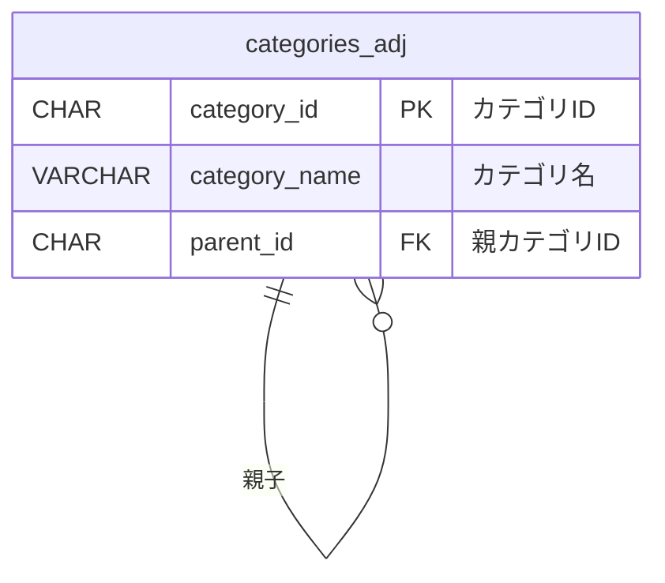
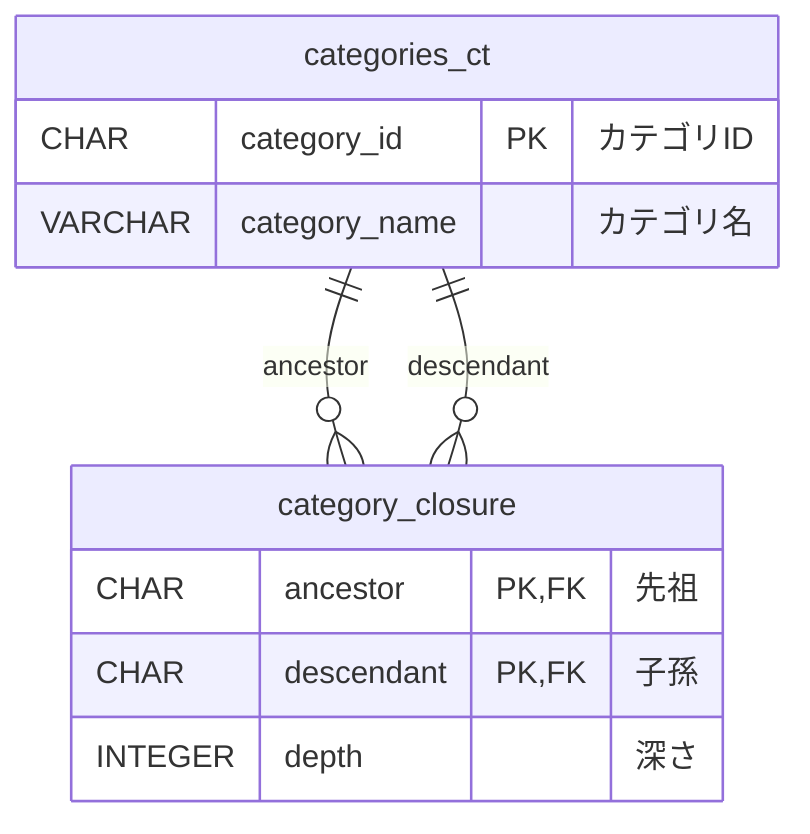

# 第9章 一歩進んだ論理設計 〜RDBで木構造を扱う - 学習ノート

## 書籍の内容

RDBは本来フラットな二次元テーブルであり、木構造を自然に表現できない。この章では2つのモデルを紹介:

| # | モデル | 概要 |
|---|---|---|
| 9-2 | 隣接リストモデル | 各ノードが「親」を参照する。シンプルだがWITH RECURSIVEが必要 |
| 9-3 | 閉包テーブルモデル | 全ての先祖-子孫ペアを別テーブルに格納。検索は速いがデータ量が多い |

## ER図

### 隣接リストモデル



### 閉包テーブルモデル



### カテゴリの木構造

```
家電 (C001)
├── PC (C002)
│   ├── ノートPC (C005)
│   └── デスクトップPC (C006)
├── カメラ (C003)
│   ├── 一眼レフ (C007)
│   └── ミラーレス (C008)
└── オーディオ (C004)
    └── ヘッドホン (C009)
```

## 演習の思考過程

### 問1: 隣接リストモデルの理解

**(a) PCを単純にDELETEするとどうなるか → 選択肢2: 参照整合性制約エラー**

- FK制約にON DELETE CASCADEやON DELETE SET NULLが明示されていない場合、デフォルトはON DELETE RESTRICT（削除拒否）
- ノートPC・デスクトップPCが`parent_id = 'C002'`を参照しているため、PCは削除できない

**(b) 正しい削除手順 → 選択肢3: どちらも正しい**

- 子を親（家電）に付け替えてから削除 → 子カテゴリを残したい場合
- 子も先に削除してから削除 → 子カテゴリごと不要な場合
- どちらもDB操作として参照整合性を壊さない正しい手順であり、どちらを選ぶかはビジネス要件次第

### 問2: 閉包テーブルモデルの理解

**(a) 閉包テーブルモデルの利点 → 選択肢1, 3**

- **選択肢1が正しい理由**: closureテーブルに全先祖-子孫ペアが事前に格納されているため、`SELECT descendant FROM category_closure WHERE ancestor = 'C001'`のようなJOINだけで子孫を取得できる。隣接リストモデルではWITH RECURSIVEで再帰的にたどる必要がある
- **選択肢3が正しい理由**: あるノードを`descendant`として持つ行のうち、ルートからの`depth`の最大値で階層の深さがわかる。隣接リストモデルでは再帰で階層を数える必要がある
- **選択肢2が誤りの理由**: closureテーブルは「全ての先祖-子孫ペア」を格納するため、ノード数の二乗に近づきデータ量は隣接リストより多い
- **選択肢4が誤りの理由**: ノードの追加・削除時には、そのノードに関連する先祖-子孫ペアをclosureテーブルにも追加・削除する必要がある。closureテーブルの整合的な更新は不可欠

**(b) 自分自身のペア（depth=0）の意味 → 選択肢2**

- 閉包テーブルモデルは数学の「反射的推移閉包（reflexive transitive closure）」に基づく
- **「自分自身も自分の先祖・子孫である」というのがこのモデルの定義・取り決め**
- 毎回具体ケースから考えるものではなく、「閉包テーブルでは自分自身のペアを必ず入れる」と覚えてよい
- 実用上の利点: 子孫取得クエリ（`WHERE ancestor = 'C001'`）で起点ノード自身も結果に含まれる。これがないと起点が抜け落ちる

### 問3: 設計判断

**シナリオA（組織図）→ 隣接リストモデル**

- 「直属の上司」「直属の部下」は親子1階層の探索で済むので、隣接リストで十分
- 年1-2回の組織変更がある → closureテーブルの更新コストを考えると隣接リストの方がシンプル

**シナリオB（ECカテゴリ）→ 閉包テーブルモデル**

- 「あるカテゴリ以下の全商品」は多階層の子孫探索が毎秒数百回実行される → 隣接リストだとWITH RECURSIVEが毎回走り負荷が大きい。閉包テーブルならJOIN一発
- 構造変更が稀 → closureテーブルの更新コストが問題にならない

**判断の軸: 検索の複雑さ・頻度と、構造変更の頻度のトレードオフ**
